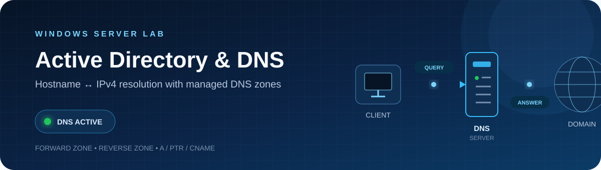
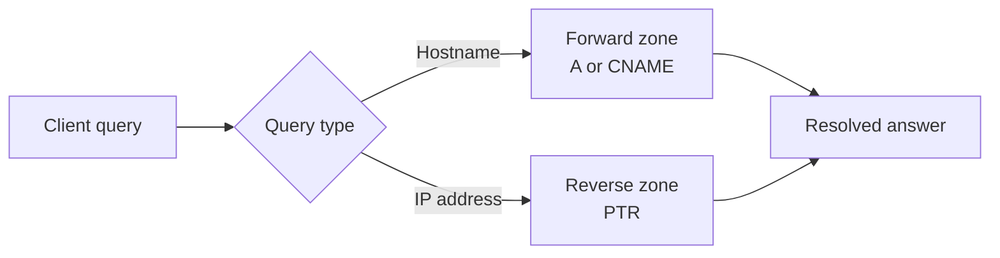
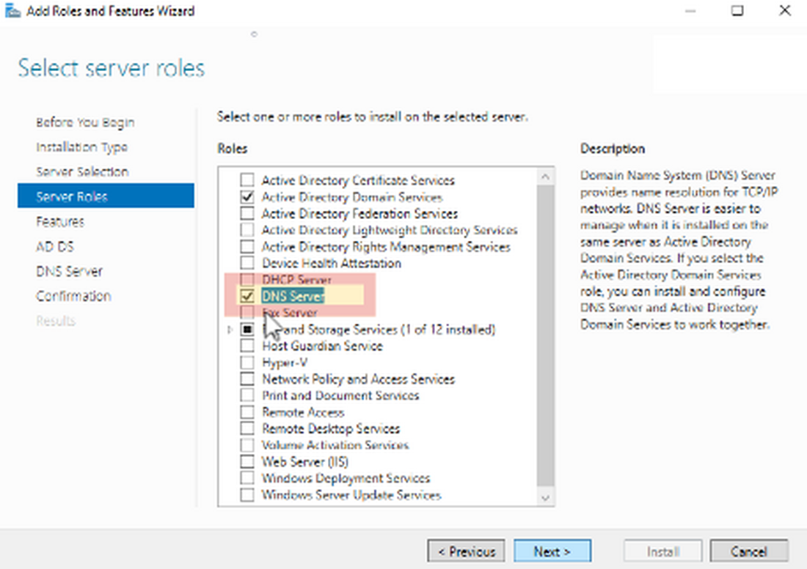
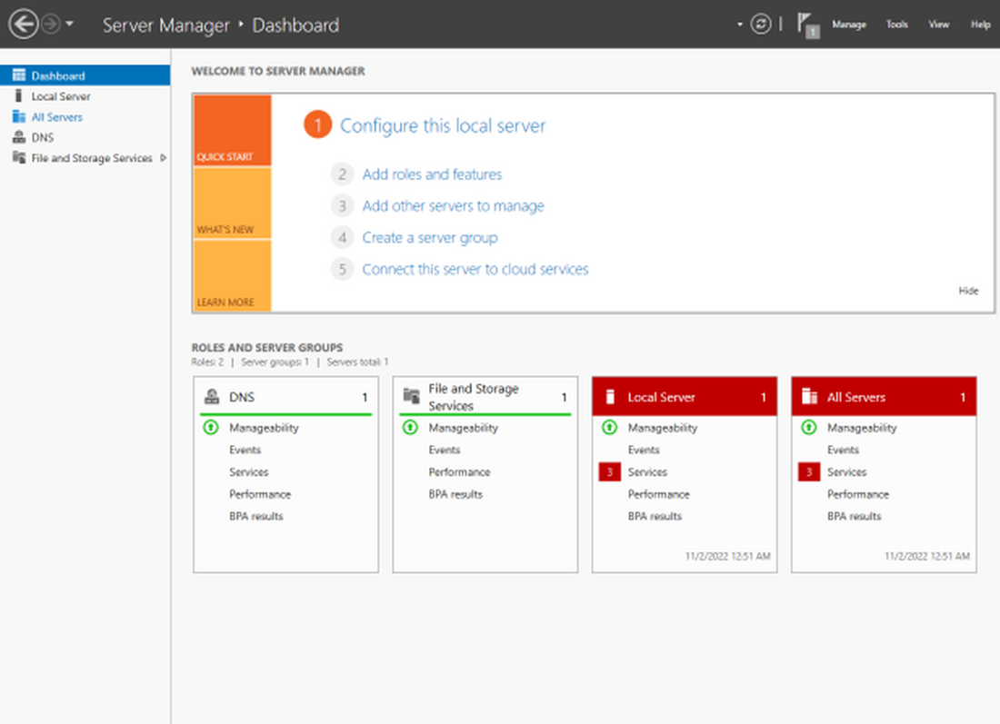
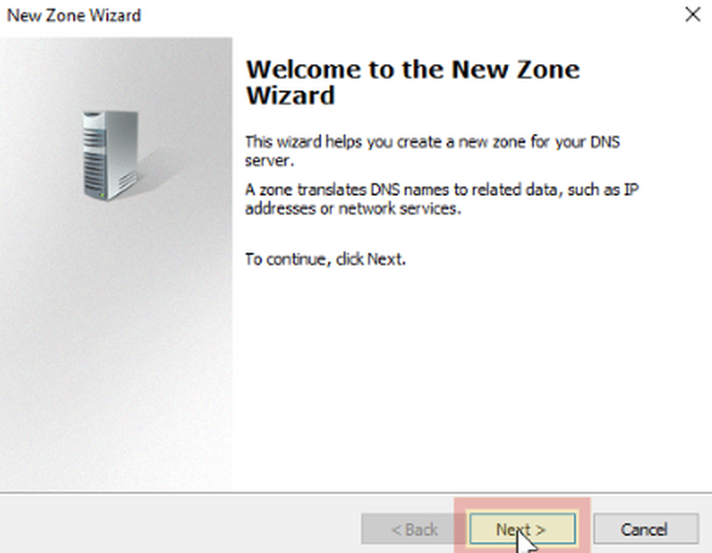
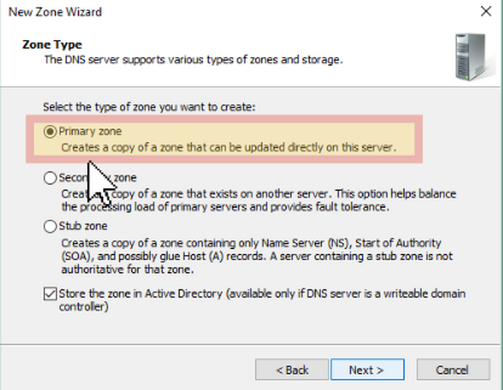
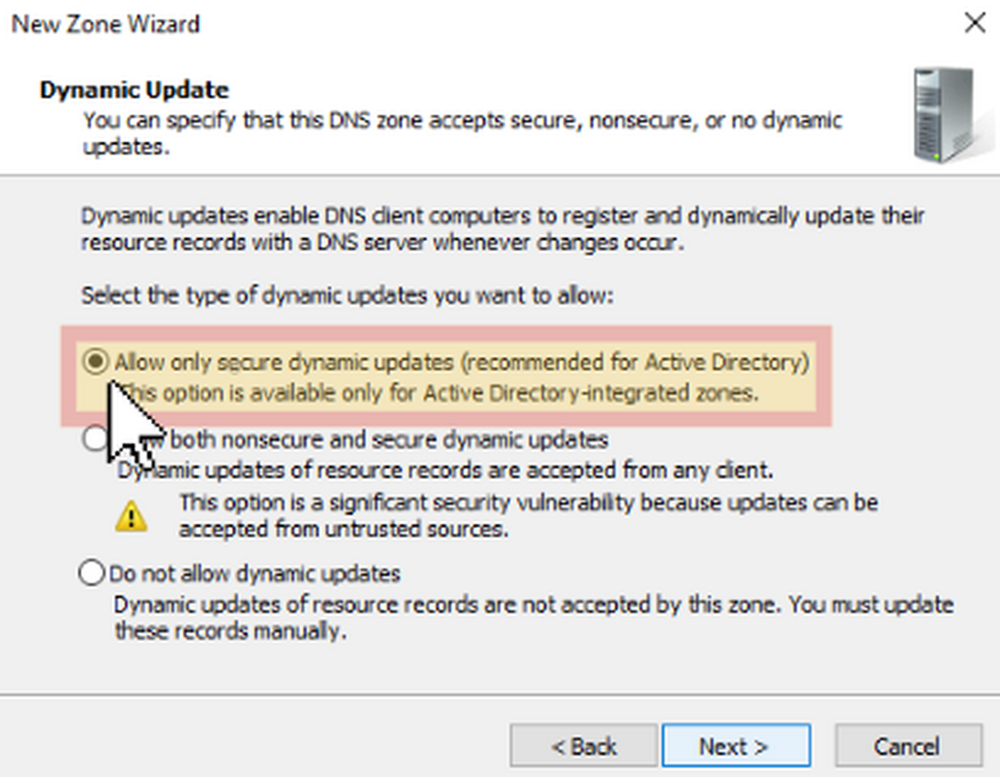
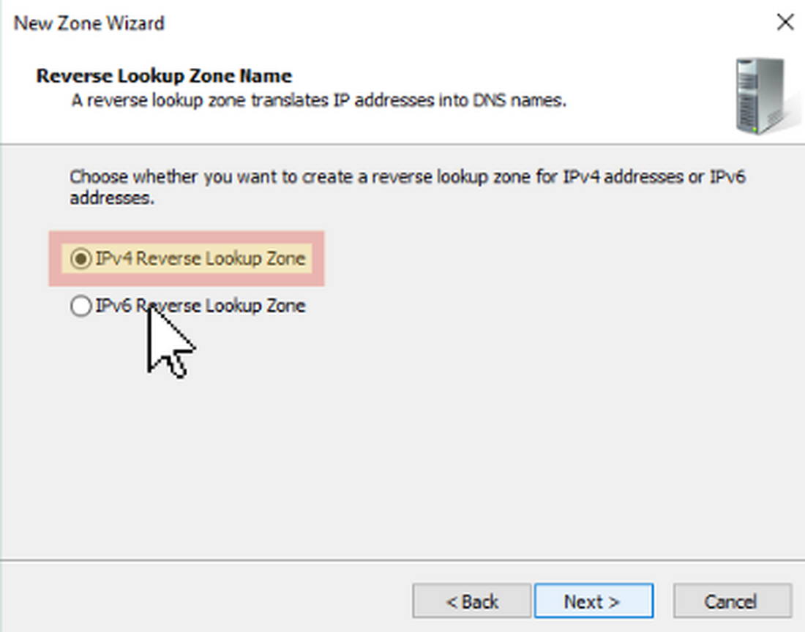

<p align="center">
  
</p>

<h1 align="center">Active Directory and DNS Lab</h1>

<p align="center">
  A Windows Server lab demonstrating structured name resolution, DNS zone management and client-side validation.
</p>

<p align="center">
  
  
  
  
</p>

<p align="center">
  <a href="#lab-overview">Overview</a> •
  <a href="#dns-resolution-flow">DNS Flow</a> •
  <a href="#implementation">Implementation</a> •
  <a href="#reference-gallery">Gallery</a> •
  <a href="docs/dns-setup.md">Setup Guide</a>
</p>

---

## Lab Overview

This repository documents the DNS phase of a university Windows Server lab. It demonstrates how a DNS server translates hostnames into IPv4 addresses, performs reverse lookups and provides consistent name resolution to connected clients. The Active Directory phase will be added when its supporting material is available.

| Lab focus | Outcome |
| :--- | :--- |
| **DNS role deployment** | DNS Server installed and available through Server Manager |
| **Forward lookup** | Hostnames resolved through `A` and `CNAME` records |
| **Reverse lookup** | IPv4 addresses resolved through `PTR` records |
| **Client validation** | Resolution checked with `nslookup`, `ping` and DNS cache tools |

## DNS Resolution Flow



## Objectives

| | Objective |
| :---: | :--- |
| **01** | Install and configure the DNS Server role on Windows Server. |
| **02** | Build a forward lookup zone for hostname-to-IP resolution. |
| **03** | Build an IPv4 reverse lookup zone for IP-to-hostname resolution. |
| **04** | Create and validate `A`, `PTR` and `CNAME` resource records. |
| **05** | Test resolution and connectivity from a Windows client. |

## Lab Environment

| Component | Role in the lab |
| :--- | :--- |
| **Windows Server** | Hosts and manages the DNS service |
| **Windows client** | Generates hostname and reverse-resolution queries |
| **DNS Manager** | Creates zones and resource records |
| **PowerShell / Command Prompt** | Runs configuration and validation commands |
| **Lab network** | Connects the server and client systems |

## Implementation

| Phase | Configuration | Status |
| :---: | :--- | :---: |
| **01** | Assign a stable server IPv4 configuration | `Complete` |
| **02** | Install the DNS Server role | `Complete` |
| **03** | Create a primary forward lookup zone | `Complete` |
| **04** | Create an IPv4 reverse lookup zone | `Complete` |
| **05** | Configure host, pointer and alias records | `Complete` |
| **06** | Validate forward, reverse and alias resolution | `Complete` |

<p align="center">
  <a href="docs/dns-setup.md"><strong>Open the complete DNS setup guide →</strong></a>
</p>

## Validation Commands

```powershell
ipconfig /all
ipconfig /flushdns
nslookup server.corp.example.test
nslookup 192.0.2.10
ping server.corp.example.test
```

> The domain and addresses are documentation-only examples. `192.0.2.0/24` is reserved for documentation and does not expose the original lab network.

## Reference Gallery

| DNS role installation | Server Manager confirmation |
| :---: | :---: |
|  |  |
| **Select the DNS Server role** | **Confirm the installed server role** |

| Forward lookup zone | Primary zone type |
| :---: | :---: |
|  |  |
| **Open the New Zone Wizard** | **Create a primary DNS zone** |

| Secure updates | Reverse lookup zone |
| :---: | :---: |
|  |  |
| **Restrict dynamic updates** | **Select IPv4 reverse lookup** |

<details>
<summary><strong>Screenshot source notice</strong></summary>

These generic Windows Server interface images were supplied from a senior's logbook and sanitized for temporary reference use. They illustrate where DNS settings are located but are not presented as proof of my own lab execution. They should be replaced with original screenshots when available and published only with the owner's permission.

</details>

## Security Notes

- Use secure dynamic updates when DNS is integrated with Active Directory.
- Restrict zone transfers to authorized DNS servers.
- Apply least privilege to DNS administration.
- Keep Windows Server patched and review DNS event logs.
- Avoid exposing internal DNS zones directly to the public internet.
- Remove real hostnames, credentials and addresses before publishing evidence.

## Skills Demonstrated

`Windows Server` &nbsp; `DNS Administration` &nbsp; `Forward Lookup` &nbsp; `Reverse Lookup` &nbsp; `Resource Records` &nbsp; `Network Testing` &nbsp; `Technical Documentation`

## Repository Structure

```text
active-directory-dns-lab
├── docs
│   ├── images
│   │   ├── dns-network-banner.svg
│   │   └── dns reference screenshots
│   └── dns-setup.md
└── README.md
```

## Next Phase

Active Directory Domain Services configuration will be added after the original lab material is available.
